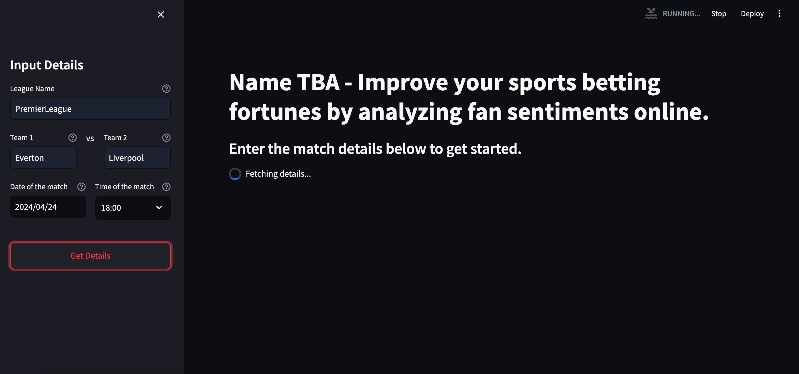
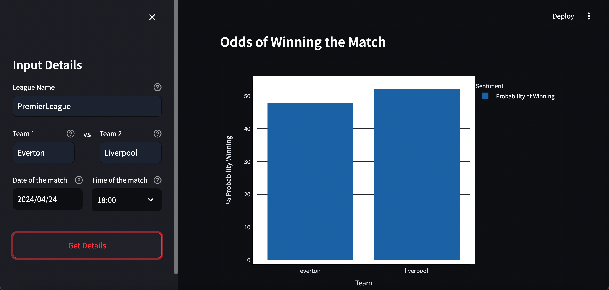
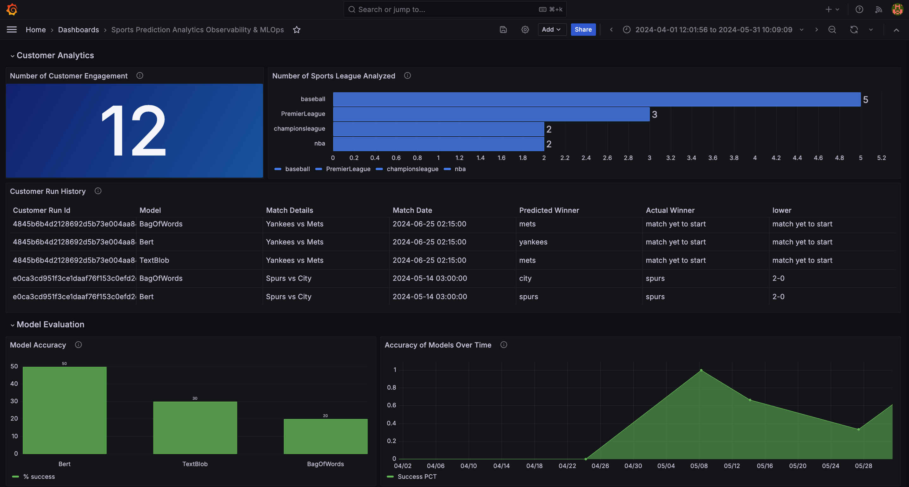

## Active Project

The idea of this project is to predict the win/loss odds of teams in a sports match. The core of the analysis is to understand and explore the why fans could be the best analyst of the sport, and augment the information on the sport before betting.

### Pre-requisities:<br><br>
-- MongoDB is installed, and  open to all requests at port: 27017<br>
-- Postgresql is installed, and open to all requests at port: 5432 (Optional, if Grafana is inactive, credentials can also be changed using util files)<br>
-- Miniconda is installed <br><br> (For mac, follow the below miniconda installation using brew)<br>

```bash
/bin/bash -c "$(curl -fsSL https://raw.githubusercontent.com/Homebrew/install/HEAD/install.sh)"
brew install --cask miniconda
conda init
```
Restart your terminal, and check the miniconda version 

```
conda --version
```

-- Absolute must for Reddit scrapping: .env to be created for API credentials (Reddit,.etc). Check docs for more information!<br>
(In case, you are having difficulties creating a Reddit API credential, please reach out to me so I can give you my .env credetials for testing) <br>

```
USER_AGENT=Mozilla/5.0
CLIENT_ID=***********
CLIENT_SECRET=***********
USERNAME=***********
PASSWORD=***********
```


### Commands to setup 

```bash
git clone https://github.com/rishikesanr/Sports-Prediction-Analytics.git
cd <path-to-current-repository>
conda env create -f ./envs/environment.yml
```

### Run the sports prediction and Get the Insights 

You can do it either by running in the backend, and get the results in the MLOps dashboards, or use streamlit to get the insights on the UI, and use MLOps dashboards for other insights.<br><br>

#### Run in the bash:

All you need are just these three inputs:<br><br>
**League Name**: Make sure this league has a subreddit, and enter the same name. <br>
**Match Details**: Only enter the teams most called name, for instance United for Manchester United, or just Yankees for New York Yankees etc. And make sure the order of team name in the match details are correct. For instance, mention "Everton vs Liverpool" if Everton are playing at their home, not the other way around "Liverpool vs Everton".<br>
**Date & Time**:Enter the date & time (UTC) of the scheduled match, or historical match.<br>

```bash
conda activate sports-analytics
python3 main.py PremierLeague "Everton vs Liverpool" "2024-04-24 19:00:00"
python3 main.py mlb "Yankees vs Mets" "2024-03-25 23:10:00"
```

#### Run with streamlit UI:

 <br>


You can start the server by running the below command

```
streamlit run ./streamlit.py
```

Once the server starts the running, go to the UI, and enter the details, and follow the instructions. <br><br>


This exploration holds the potential to yield valuable insights that could impact betting outcomes.

Model 1 - A simple sentiment approach using Bag of Words from Fans
(Optional. A simple sentiment model approach using Bag of Words from Critics, A simple ensmeble sentiment model approach using Bag of Words from both Fans& Critics)

Model 2 - Applying PyTorch/TextBlob frameworks for generating sentiment scores

Model 3 - Fine tuning open LLMs (Llama2, BERT) for sentiment analysis (At the present, a fine-tuned BERT model in implemented using a untrained classifier)

Model 4 - Ensemble of Model 1,2, and 3

A microservices to be followed for the prodcut implementation(MongoDB, PostgresSQL, Streamlit (UI), Grafana(MLOps), and Airflow for autmoating real time dashboards). 

#### Application Customer Observability and MLOps in Grafana



